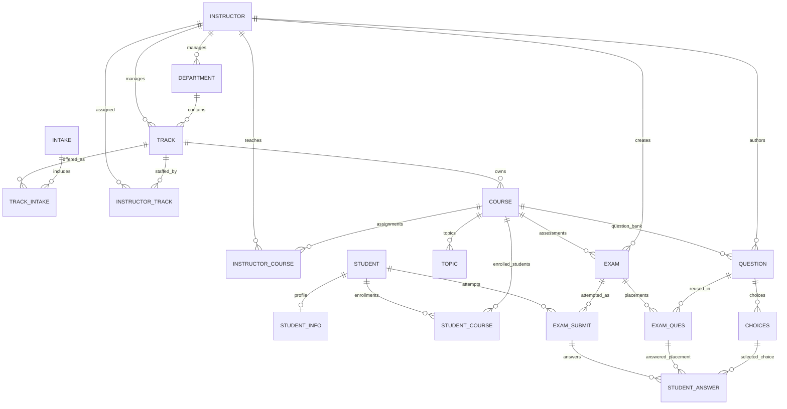

# ITI Examination System Database Discovery and Domain Analysis

Analysis date: 2026-09-06  
Primary source: live SQL Server LocalDB database `ITI_EXAMINATION` on `(localdb)\MSSQLLocalDB`  
Method: read-only metadata queries, aggregate integrity queries, deployed module definitions, SQL source review, ERD inspection, Word-document extraction and visual inspection, and PDF/RDL report inspection. No database object or row was changed.

Evidence labels used throughout:

- **Confirmed** means directly established by the live schema, deployed SQL module, or aggregate data query.
- **Strong inference** means multiple sources support the conclusion, but the database does not enforce it completely.
- **Ambiguous** means the available sources conflict or do not define the requirement.

Supporting catalogs: [live schema catalog](analysis/Schema-Catalog.md), [stored procedure catalog](analysis/Procedure-Catalog.md), [captured live metadata](analysis/evidence/live-database.json), and [read-only integrity results](analysis/evidence/live-integrity.txt).

## 1. Executive Summary

The system models an ITI academic structure and an objective-question examination process. Departments contain tracks; tracks own courses and are offered in intakes; instructors manage and work in tracks and receive dated course assignments; students have accounts, optional profile rows, a textual track identifier, course enrollments, exam attempts, and selected answers. Courses contain ordered topics, a question bank, and exams. An exam receives a selected set of questions through `EXAM_QUES`. A student's sitting is represented by `EXAM_SUBMIT`, and individual responses are represented by `STUDENT_ANSWER`.

The operational center is this chain:

```text
COURSE -> QUESTION -> CHOICES
   |          |
   v          v
 EXAM -> EXAM_QUES
   |
   v
EXAM_SUBMIT -> STUDENT_ANSWER
```

**Confirmed:** `EXAM_SUBMIT` is an exam attempt, not merely a final submission or result. It is created at start time with `in_progress`, carries an attempt number, becomes `submitted` and then `graded`, and stores the result total. The name therefore hides three roles: attempt lifecycle, submission event, and result summary.

**Confirmed:** the deployed workflow supports only automatically graded single-choice objective questions. `QUESTION.question_type` permits `MCQ` and `TrueFalse`; every answer selects one `CHOICES` row; `sp_SubmitAnswer` immediately copies correctness and marks into `STUDENT_ANSWER`; `sp_GradeExam` merely sums cached marks.

**Confirmed:** the live database contains 21 base tables, 95 stored procedures, three triggers, one scalar function, no user view, 27 foreign keys, 31 check constraints, and 33 indexes. Of the procedures, 88 are application procedures: 72 generic CRUD wrappers and 16 examination/reporting procedures. Seven procedures and the function belong to SQL Server diagram support.

The live database is materially different from the main SQL creation script and documentation. The most consequential differences are:

- `STUDENT.stud_id` is an identity column in the live database, although the creation script defines it as a caller-supplied integer and `sp_InsertStudent` still explicitly inserts it.
- The live `STUDENT.track_id` has no foreign key and no live login/password checks, although the creation script defines all three constraints.
- The creation script defines three validation triggers for choice sets and answer choices; none is deployed. Only the three primary-key generation triggers are live.
- The live database contains `STUDENT_TEMP`, `__EFMigrationsHistory`, and `sysdiagrams`; the business documentation describes 18 tables and omits the first two operationally relevant extras.
- The live data exposes major integrity failures: 149 questions lack at least two choices and exactly one correct choice, 160 exam-question assignments cross course boundaries, 60 exams have configured marks that do not equal their question allocations, and 55 stored attempt scores exceed their exam total.
- All 480 live attempts are `graded`, but `STUDENT_ANSWER` contains zero rows. Therefore the saved attempt totals cannot currently be audited from answers.

The database supports a viable domain model, but its stored procedures and constraints are not a reliable security or integrity boundary. The later API should preserve the database-first mapping while placing orchestration, authorization, validation, state transitions, and transactional boundaries in explicit application use cases. Schema changes should be considered only after this analysis is reviewed and data remediation is planned.

## 2. Database Object Inventory

### Application tables

| Group | Tables |
| --- | --- |
| Organization | `DEPARTMENT`, `TRACK`, `INTAKE`, `TRACK_INTAKE` |
| People | `INSTRUCTOR`, `STUDENT`, `STUDENT_INFO` |
| Assignments and enrollment | `INSTRUCTOR_TRACK`, `INSTRUCTOR_COURSE`, `STUDENT_COURSE` |
| Curriculum and question bank | `COURSE`, `TOPIC`, `QUESTION`, `CHOICES` |
| Examination | `EXAM`, `EXAM_QUES`, `EXAM_SUBMIT`, `STUDENT_ANSWER` |
| Unclassified/staging | `STUDENT_TEMP` |
| Tooling | `__EFMigrationsHistory`, `sysdiagrams` |

Current row counts are recorded in the [schema catalog](analysis/Schema-Catalog.md). The largest domain tables are `STUDENT_COURSE` (2,292), `STUDENT_TEMP` (987), `STUDENT` (986), `EXAM_SUBMIT` (480), and `STUDENT_INFO` (465).

### Programmability objects

- **95 stored procedures:** 72 CRUD procedures; `sp_GenerateRandomExam`, `sp_ActivateExam`, `sp_ViewExamDetails`; seven attempt/submission procedures; six reporting procedures; and seven SQL Server diagram procedures.
- **Three triggers:** `trg_EXAM_QUES_AutoID`, `trg_EXAM_SUBMIT_AutoID`, and `trg_STUDENT_ANSWER_AutoID`. All are enabled `INSTEAD OF INSERT` triggers.
- **One function:** `fn_diagramobjects`, used only by SQL Server diagram tooling.
- **No user views, inline table-valued functions, table-valued functions, sequences, synonyms, or user-defined table types** were found by live metadata inspection.

### Reference artifacts inspected

- SQL: `ExaminationSystem_ITI.sql`, both CRUD files, CRUD usage guide, random-exam procedures, student-submission procedures, and reporting procedures.
- Backup: `ITI_EXAMINATION.bak`; header identifies database `ITI_EXAMINATION`, SQL Server 2019 compatibility level 150, backup time 2026-01-24 23:39:39, and source LocalDB.
- ERD: `ExaminationSystemITI_ERD.png` and `Mapping_ExaminationSystemITI.png`.
- Documentation: all three DOCX files under `Database Report Documents`.
- Reports: all six PDFs, all six RDL files, and all six report screenshots under `reports and insights`.

## 3. Table-by-Table Analysis

Exact columns, SQL types, nullability, defaults, keys, checks, indexes, and FK actions appear in the [live schema catalog](analysis/Schema-Catalog.md). This section interprets their domain roles.

### `DEPARTMENT`

**Confirmed:** academic organizational unit with a unique name, optional description, and required manager FK to `INSTRUCTOR`. One instructor may manage several departments because `dept_manager_id` is not unique. A department can exist without a track; the database cannot enforce “at least one track.” Deleting a department cascades to tracks, but downstream `COURSE`/`STUDENT` references can block that operation.

### `TRACK`

**Confirmed:** curricular specialization owned by one department and managed by one instructor. Track name is globally unique. It is the parent of courses and participates in track-intake and instructor-track associations. The student relationship is only textual in the live database because `STUDENT.track_id` lacks an FK.

### `INTAKE`

**Confirmed:** master record for a dated cohort period. Start must be on or after 2000-01-01 and end must follow start. It is associated with tracks through `TRACK_INTAKE`, but there is no student-to-intake relationship. Therefore the database cannot answer which intake a particular student belongs to.

### `TRACK_INTAKE`

**Confirmed:** associative entity for an offering of a track in an intake, keyed by `(track_id, intake_number)`, with its own start/end and optional positive capacity. Its dates need not fall within the parent intake dates, and capacity is not checked against student counts because students do not reference an offering.

### `INSTRUCTOR`

**Confirmed:** staff record and shared principal for department management, track management, question/exam authorship, track staffing, course teaching, and optional course introduction. Salary is nonnegative, gender is `M`/`F`, minimum age is calculated as 21, and age is a non-persisted computed value based on the current date. There is no authentication record or instructor login.

### `INSTRUCTOR_TRACK`

**Confirmed:** current-or-undated instructor membership in a track with assignment date and optional free-text role. Composite PK `(instructor_id, track_id)` prevents multiple historical assignments of the same instructor to the same track. This represents staffing, separate from `TRACK.track_manager_id`.

### `STUDENT`

**Confirmed:** student account plus a track code. Live `stud_id` is `IDENTITY(1,1)` and login is unique. Password is stored as `NVARCHAR(255)` without evidence of hashing or salting; representative source data and usage documentation show plaintext-style values. The live database has no FK on `track_id` and no checks for minimum login/password lengths.

**Strong inference:** this is the student identity/account root, but it is not a complete authentication model: there are no roles, refresh tokens, lockout fields, password metadata, or audit fields.

### `STUDENT_INFO`

**Confirmed:** a real dependent table, not a view or reporting projection. Its PK is also an FK to `STUDENT`, producing zero-or-one profile per student. It contains personal/contact/demographic data and a non-persisted age calculation. `phone` and `FB_email` are nullable unique constraints; SQL Server permits only one NULL per ordinary unique constraint, which may make optional-profile insertion surprising.

**Confirmed:** the relationship is not mandatory from the student side. The live database has 986 students but only 465 profiles; 521 students have no profile. Documentation saying every student has exactly one profile is not enforced and is false for current data. Some report and select procedures use inner joins to `STUDENT_INFO`, silently excluding those students.

### `COURSE`

**Confirmed:** track-owned curriculum item with positive 1–6 credit hours, optional category, and optional “introduced by” instructor. Course name is unique only within a track. `introduce_by` has `NO ACTION`, not `SET NULL`. The course is the parent of topics and exams and is referenced by questions and enrollments/teaching assignments.

### `STUDENT_COURSE`

**Confirmed:** enrollment/academic record keyed by `(student_id, course_id)`. It stores enrollment date, optional completion date, optional letter grade, and status among `enrolled`, `completed`, `withdrawn`, and `failed`. The key prevents reenrollment/history for the same student-course pair. No intake, term, section, instructor, or attempt is recorded.

**Confirmed:** course grades are independent of exam results. No trigger or workflow updates `STUDENT_COURSE.grade` from `EXAM_SUBMIT`. The reporting procedure classifies `C` as pass and `C-` as fail, which is reporting policy rather than a schema rule.

### `INSTRUCTOR_COURSE`

**Confirmed:** dated teaching assignment keyed by `(instructor_id, course_id, course_date)`, with a separately checked `for_year`. It permits multiple dated assignments for an instructor/course, but has no track-intake, term, section, end date, or role. It does not require that the instructor be assigned to the course's track.

### `TOPIC`

**Confirmed:** ordered course syllabus content. `(course_id, topic_order)` is unique; topic names need not be unique. Deleting a course cascades topics. Questions do not reference topics, so topic coverage and topic-specific generation cannot be inferred or enforced.

### `QUESTION`

**Confirmed:** course-specific reusable question bank entry with identity PK, required author, content, type, positive default marks, optional difficulty, and creation date. Type is limited to `MCQ` and `TrueFalse`; difficulty is `Easy`, `Medium`, `Hard`, or NULL. The author need not teach the course. A question can be used in multiple exams, but at most once per exam through `EXAM_QUES` uniqueness.

### `CHOICES`

**Confirmed:** selectable answer option with a global caller-supplied string ID, question FK, current correctness flag, and optional one-character order. `(question_id, choice_order)` is unique. Because order is nullable, multiple rows may have NULL order. No live constraint enforces at least two choices, exactly one correct choice, or exactly two choices for `TrueFalse`.

### `EXAM`

**Confirmed:** assessment definition tied to one course and one creating instructor. It stores title, total marks, passing score, duration, date, optional `total_result`, and status (`draft`, `active`, `completed`, `archived`). Passing score must be positive and no greater than total marks. No dates define availability, no maximum attempt count exists, and no status-transition trigger exists.

**Ambiguous:** `total_result` has no procedure usage and no documented stable meaning. It may have been intended as an aggregate result, but the live system does not calculate it.

### `EXAM_QUES`

**Confirmed:** exam-question placement and assessment-specific mark allocation. Its generated PK format is `<exam_id>-Q<question_order padded to 3>`. `(exam_id, question_order)` and `(exam_id, question_id)` are unique. The table permits a question from a different course than the exam; 160 live rows do so. It also permits allocated marks to differ from `QUESTION.marks` and the sum to differ from `EXAM.total_marks`; 60 exams currently mismatch.

### `EXAM_SUBMIT`

**Confirmed:** exam attempt aggregate record. Generated PK format is `SUB<student_id>-<exam_id>-A<attempt_number>`. Unique `(student_id, exam_id, attempt_number)` supports retakes in theory. It stores start and submission timestamps, redundant submission date, stored total score, and lifecycle status. All 480 live rows are graded; attempts range only from 1 to 1, so no live retake is present.

It serves three domain concepts in one row:

1. attempt identity and start state;
2. submission state and time;
3. grade/result summary.

No duration constraint compares submission time to `EXAM.duration_minutes`. No constraint caps score at exam total, and 55 rows exceed it.

### `STUDENT_ANSWER`

**Confirmed:** selected choice for one exam-question placement in one attempt. Unique `(student_exam_id, exam_question_id)` enforces one current answer per placement per attempt. It stores derived `is_correct` and `marks_earned`, allowing historical results to be preserved if grading logic later changes, but those values can also drift from current choices and allocated marks.

**Confirmed:** the live table is empty while 480 attempts are graded. Current results cannot be reconstructed or audited. Foreign keys independently validate the attempt, exam question, and choice, but no composite constraint ensures the question belongs to the attempt's exam. The absent validation trigger would only check choice-to-question, not attempt-to-exam.

### `STUDENT_TEMP`

**Confirmed:** live-only heap with the same four logical columns as `STUDENT`, but no PK, FK, unique constraint, default, or index. It has 987 distinct rows; 986 exactly match every current `STUDENT` row and one does not. No deployed module references it.

**Strong inference:** it is a staging, migration, import, or backup copy rather than a domain entity. Its exact purpose and retention policy are undocumented. It contains passwords and therefore presents unnecessary exposure if retained.

### `__EFMigrationsHistory`

**Confirmed:** standard EF Core bookkeeping table, currently empty. There are no EF Core models or `DbContext` files in the inspected project. Its presence does not prove migrations manage this schema.

### `sysdiagrams`

**Confirmed:** SQL Server Management Studio diagram support table, currently empty, with seven supporting procedures and one function. It is tooling metadata, not part of the examination domain.

## 4. Primary and Foreign Keys

There are 18 domain PKs plus tooling PKs. Natural/string identifiers are used for instructors, departments, tracks, intakes, courses, topics, choices, exams, placements, attempts, and answers. `QUESTION` and live `STUDENT` use identity integers. Four business association tables use composite keys: `TRACK_INTAKE`, `INSTRUCTOR_TRACK`, `STUDENT_COURSE`, and `INSTRUCTOR_COURSE`.

The 27 live foreign keys establish these child-to-parent relationships:

| Child | Parent | Delete behavior |
| --- | --- | --- |
| `DEPARTMENT.dept_manager_id` | `INSTRUCTOR` | Restrict |
| `TRACK.track_manager_id` | `INSTRUCTOR` | Restrict |
| `TRACK.dept_id` | `DEPARTMENT` | Cascade |
| `TRACK_INTAKE.track_id` / `.intake_number` | `TRACK` / `INTAKE` | Cascade / Cascade |
| `INSTRUCTOR_TRACK.instructor_id` / `.track_id` | `INSTRUCTOR` / `TRACK` | Cascade / Cascade |
| `STUDENT_INFO.stud_id` | `STUDENT` | Cascade |
| `COURSE.track_id` / `.introduce_by` | `TRACK` / `INSTRUCTOR` | Restrict / Restrict |
| `STUDENT_COURSE.student_id` / `.course_id` | `STUDENT` / `COURSE` | Cascade / Restrict |
| `INSTRUCTOR_COURSE.instructor_id` / `.course_id` | `INSTRUCTOR` / `COURSE` | Restrict / Cascade |
| `TOPIC.course_id` | `COURSE` | Cascade |
| `QUESTION.course_id` / `.created_by_inst_id` | `COURSE` / `INSTRUCTOR` | Restrict / Restrict |
| `CHOICES.question_id` | `QUESTION` | Cascade |
| `EXAM.course_id` / `.created_by_inst_id` | `COURSE` / `INSTRUCTOR` | Cascade / Restrict |
| `EXAM_QUES.exam_id` / `.question_id` | `EXAM` / `QUESTION` | Cascade / Restrict |
| `EXAM_SUBMIT.student_id` / `.exam_id` | `STUDENT` / `EXAM` | Cascade / Restrict |
| `STUDENT_ANSWER.student_exam_id` / `.exam_question_id` / `.selected_choice_id` | `EXAM_SUBMIT` / `EXAM_QUES` / `CHOICES` | Cascade / Restrict / Restrict |

All captured FKs are enabled and trusted. The major missing FK is live `STUDENT.track_id -> TRACK.track_id`. Cross-table business consistency also lacks composite keys for exam-course-question and attempt-exam-question alignment.

## 5. Relationship Map

Business interpretation of the live relationships:

```text
INSTRUCTOR 1 ---- * DEPARTMENT (manager)
INSTRUCTOR 1 ---- * TRACK      (manager)
DEPARTMENT 1 ---- * TRACK
TRACK * ---- * INTAKE          via TRACK_INTAKE
INSTRUCTOR * ---- * TRACK      via INSTRUCTOR_TRACK

TRACK 1 ---- * COURSE
INSTRUCTOR * ---- * COURSE     via INSTRUCTOR_COURSE
INSTRUCTOR 1 ---- * COURSE     optional introducer
STUDENT * .... 1 TRACK         intended, but live FK is missing
STUDENT * ---- * COURSE        via STUDENT_COURSE

COURSE 1 ---- * TOPIC
COURSE 1 ---- * QUESTION
INSTRUCTOR 1 ---- * QUESTION   creator
QUESTION 1 ---- * CHOICES

COURSE 1 ---- * EXAM
INSTRUCTOR 1 ---- * EXAM       creator
EXAM * ---- * QUESTION         via EXAM_QUES
STUDENT * ---- * EXAM          via EXAM_SUBMIT attempts
EXAM_SUBMIT 1 ---- * STUDENT_ANSWER
EXAM_QUES   1 ---- * STUDENT_ANSWER
CHOICES     1 ---- * STUDENT_ANSWER
```

Required child-side relationships are expressed by NOT NULL FKs except the missing student-track FK. Parent-side minimum cardinalities in the documents—such as every department having a track, every intake being offered, and every student having a profile—are not enforceable through these FKs.

## 6. ERD Reconstruction



The dotted conceptual relation `STUDENT -> TRACK` is deliberately omitted from the enforced Mermaid relationships because it has no live FK. `STUDENT_TEMP`, EF migration history, and diagram tooling are excluded from the domain ERD.

Aggregate-like groups suggested by the schema are:

- **Exam definition:** `EXAM` with `EXAM_QUES`, reading `QUESTION` and `CHOICES` from the question bank.
- **Attempt:** `EXAM_SUBMIT` with `STUDENT_ANSWER`.
- **Question bank item:** `QUESTION` with `CHOICES`.
- **Student record:** `STUDENT` with optional `STUDENT_INFO` and associated enrollments.
- **Track offering:** `TRACK_INTAKE`, although it has no student membership link.

## 7. Important Constraints and Indexes

The live database has 31 enabled, trusted checks. Important domains include instructor gender/age/salary; intake dates; track-intake dates/capacity; student profile gender/age; course credit hours; enrollment status/date/grade; instructor-course year; topic order; question type/marks/difficulty; exam totals/pass threshold/duration/status; placement order/marks; attempt time/number/status/nonnegative score; and nonnegative answer marks.

Unique constraints enforce department and track names, student login, student profile phone/email, course name within track, topic order within course, choice order within question, question/order uniqueness within exam, attempt number within student/exam, and one answer per attempt/placement.

**Confirmed:** all 33 live indexes exist only to support a PK or unique constraint. There are no standalone nonclustered indexes for FKs or reporting filters. `STUDENT_TEMP` is the only heap and has no index.

Important missing database rules:

- student track referential integrity;
- valid complete choice set per question;
- True/False having exactly two choices;
- exam question belonging to the exam's course;
- exam total equaling placement mark sum;
- answer placement belonging to the attempt's exam;
- cached answer grade matching selected choice and placement marks;
- attempt score no greater than exam total;
- enrollment eligibility for an attempt;
- enforcement of exam duration or availability;
- legal status transitions;
- creator/teacher/track authorization;
- one live in-progress attempt per student/exam (the ordinary unique key permits several attempt numbers).

## 8. Stored Procedure Analysis

### CRUD procedures

The 72 CRUD procedures provide insert/select/update/delete operations for the 18 documented domain tables. The [procedure catalog](analysis/Procedure-Catalog.md) records every signature, direct read/write table, and deployed definition.

Common behavior is simple table access with `TRY/CATCH` around mutations, no explicit transaction, and reliance on table constraints. Partial updates use `ISNULL(parameter, existing_value)`, so nullable fields cannot be cleared through update procedures. Missing update/delete rows produce `PRINT`, not an error. Generic answer CRUD accepts caller-supplied correctness and marks. Generic exam and attempt CRUD allows callers to bypass workflow-specific activation, eligibility, grading, and state-transition logic.

Live-breaking signature drift exists in later CRUD procedures:

- `sp_InsertStudent` explicitly supplies the live identity column.
- Exam-question procedures use `INT` parameters for live `NVARCHAR(50)` keys.
- Attempt procedures use `NVARCHAR(20)` parameters for live `NVARCHAR(50)` keys.
- Student-answer procedures use `INT` for live string answer/placement IDs and short submission IDs.

### `sp_GenerateRandomExam`

Reads `COURSE`, `INSTRUCTOR`, and `QUESTION`; writes `EXAM` and `EXAM_QUES`. It validates parent existence, nonnegative requested counts, at least one question, positive duration, and sufficient question counts by type. It does not validate title, passing percentage range, instructor-course assignment, question choice validity, difficulty distribution, or concurrency-safe ID allocation.

It fixes marks at 3 per MCQ and 2 per True/False, calculates total marks and `CEILING(total * passingPercentage/100)`, creates a timestamp/random string ID, opens a transaction, inserts a draft exam, selects questions by `ORDER BY NEWID()`, inserts placements, commits, and returns the ID. TRY/CATCH rolls back only when its local flag says it started a transaction, then re-raises with `RAISERROR`.

### `sp_ActivateExam`

Reads and updates `EXAM`, reads `EXAM_QUES`. It requires only that the exam exist and contain at least one question, then sets status to `active`. It does not require draft state, valid choices, same-course questions, matching total marks, a valid creator assignment, or a complete threshold configuration beyond table checks.

### `sp_ViewExamDetails`

Read-only query over `EXAM`, `COURSE`, `INSTRUCTOR`, `EXAM_QUES`, and `QUESTION`, returning header, question list, and counts/marks by question type.

### `sp_StartExam`

Reads `STUDENT`, `EXAM`, `COURSE`, `EXAM_SUBMIT`, and `EXAM_QUES`; writes `EXAM_SUBMIT`. It validates student/exam existence and requires active exam. Its so-called enrollment check compares the student's track with the course track and only prints a warning. It does not query `STUDENT_COURSE`, so actual enrollment is neither checked nor required.

If an in-progress attempt exists, it returns that ID. Otherwise it calculates `MAX(attempt_number)+1`, inserts an in-progress attempt, and returns the deterministic ID. There is no explicit transaction or concurrency protection around max-plus-one, no maximum attempts, no availability window, and no duration enforcement.

### `sp_GetExamQuestions`

Read-only query over exam placements, questions, and choices. It returns choices as JSON without `is_correct`, which is suitable for an exam-taking screen. It validates only exam existence; it does not require active state or a student/attempt context.

### `sp_SubmitAnswer`

Reads `EXAM_SUBMIT`, `EXAM_QUES`, and `CHOICES`; inserts or updates `STUDENT_ANSWER`. It requires an existing in-progress attempt, an existing placement, and a selected choice belonging to the placement's question. It immediately grades the answer: full allocated marks if correct, zero otherwise. An existing answer is overwritten, enabling changes while in progress.

Critical omission: it never checks that `EXAM_QUES.exam_id` equals the attempt's `exam_id`. A student can therefore attach a placement from another exam if the supplied choice belongs to that placement's question. It also does not enforce elapsed duration. There is no explicit transaction spanning validation and upsert.

### `sp_SubmitExam`

Reads the attempt, its exam placements, answers, exam, and profile; updates `EXAM_SUBMIT`; calls `sp_GradeExam`. It allows incomplete submission after a printed warning, sums cached `marks_earned`, stamps submission time/date, changes status to `submitted`, then calls grading, which changes it to `graded`. No explicit transaction makes those changes atomic. It does not enforce duration or verify cached correctness.

### `sp_GradeExam`

Reads `STUDENT_ANSWER` and updates `EXAM_SUBMIT`. It sums cached marks and unconditionally sets the attempt to `graded`. It does not validate existence, previous `submitted` status, completeness, selected choices, marks caps, or exam totals. Direct execution can grade an in-progress attempt.

### `sp_GetStudentProgress`

Read-only progress query over attempt, exam, placements, and answers. It reports elapsed versus allowed minutes but does not enforce the limit. Because it joins by the attempt's exam here, it correctly lists expected placements, including unanswered rows.

### `sp_ViewSubmissionDetails`

Read-only result review over attempts, profiles, exams, placements, questions, selected and correct choices, and answers. It derives pass/fail from saved total. It exposes correct answers after submission but does not require graded status. Multiple correct choices would duplicate rows.

### Reporting procedures

1. `sp_GetStudentsCountByTrackOrDept` is misnamed: it returns student details rather than a count, uses only `@track_id`, and ignores `@dept_id`. The RDL exposes both parameters, so the department filter shown in the report UI has no effect.
2. `sp_GetStudentCoursesAndGrades` returns enrollment records and derives pass/fail from letter grades. It does not use exam attempts.
3. `sp_GetInstructorCoursesAndStudents` returns dated course assignments and counts all enrollments in the course, not students for a specific dated teaching section.
4. `sp_GetCourseTopics` lists ordered topics.
5. `sp_GetExamQuestionsAndChoices` returns all choices including `is_correct`; it is an administrative/model-answer report and must not serve active student sessions.
6. `sp_GetStudentExamAnswersWithModel` chooses the highest attempt number and compares selected/model choices using cached `is_correct`. With no attempt, it returns exam questions as not answered. It does not require graded status.

## 9. Exam Generation Workflow

```text
Validate course and instructor
  -> count requested MCQ and TrueFalse questions
  -> require sufficient question-bank rows
  -> assign fixed marks (MCQ 3, TrueFalse 2)
  -> calculate total and ceiling-based passing score
  -> generate EXyyyyMMddNNN ID
  -> BEGIN TRANSACTION
  -> insert draft EXAM
  -> randomly insert MCQ placements
  -> randomly insert TrueFalse placements
  -> COMMIT and return ID
  -> separately activate exam
```

**Confirmed:** exam creation and placement insertion are atomic inside the procedure. The auto-ID placement trigger derives IDs from order. Random selection is course- and type-scoped.

**Strong inference:** random generation is intended as one supported authoring option; CRUD procedures and the usage guide also demonstrate manual exam creation and placement.

**Ambiguous:** whether fixed marks should override `QUESTION.marks`, whether difficulty balancing is required, whether instructors may generate only exams for assigned courses, and whether passing percentages outside 0–100 should be rejected. A negative percentage can violate the exam passing-score check; values above 100 can also violate it, but the procedure does not issue a domain-specific validation error.

## 10. Student Exam Submission Workflow

```text
StartExam
  -> validate student, exam, active status
  -> warn on track mismatch
  -> resume existing in-progress attempt or create next attempt

GetExamQuestions
  -> return ordered placements and choices without correctness

SubmitAnswer (repeat/upsert)
  -> require in-progress attempt
  -> validate placement and choice-to-question
  -> calculate cached correctness and marks
  -> insert/update answer

GetStudentProgress (optional)
  -> show answered count and elapsed time

SubmitExam
  -> warn about unanswered placements
  -> sum answer marks
  -> mark submitted
  -> GradeExam marks graded

ViewSubmissionDetails
  -> show score, pass/fail, selected answer and model answer
```

The workflow supports resume and answer changes, and allows incomplete submission. It does not enforce course enrollment, timing, ownership of the attempt by the current caller, or a maximum number of attempts.

## 11. Grading / Result Workflow

The grading model is binary per question: full `EXAM_QUES.marks_allocated` for a choice currently marked correct, otherwise zero. `sp_SubmitAnswer` calculates and caches `is_correct` and `marks_earned`; `sp_SubmitExam` and `sp_GradeExam` sum those cached marks into `EXAM_SUBMIT.total_score`; result displays compare the total with `EXAM.passing_score`.

There is no partial-credit rule in the procedure despite sample seed data containing fractional `marks_earned` on some wrong and correct answers. That historical sample behavior conflicts with the current procedure's all-or-nothing calculation.

There are two independent grade stores:

- exam result: `EXAM_SUBMIT.total_score`;
- course result: `STUDENT_COURSE.grade` and status.

No deployed database logic maps one to the other. How multiple exams and attempts determine a final course grade is unknown.

## 12. Student Enrollment Workflow

The usage guide shows account creation, profile creation, and one or more `STUDENT_COURSE` inserts. The database enforces unique student-course pairs and valid status/grade vocabularies. It does not enforce same-track enrollment, though current aggregate data contains zero cross-track enrollments.

Starting an exam does not inspect `STUDENT_COURSE`; it compares only student and course track codes and merely warns. Live data contains 460 attempts with no matching `STUDENT_COURSE` row for that exam's course. Therefore eligibility is not a reliable rule in the deployed system.

There is no intake/track-offering membership, section registration, capacity consumption, prerequisite, active enrollment period, or reenrollment history.

## 13. Instructor Assignment Workflow

The schema distinguishes four instructor relationships:

| Relationship | Meaning | Enforcement gap |
| --- | --- | --- |
| Department manager | Organizational responsibility | No role/history; manager need not otherwise belong to department |
| Track manager | Track responsibility | Manager need not appear in `INSTRUCTOR_TRACK` |
| `INSTRUCTOR_TRACK` | Instructor works in track | Only one lifetime row per instructor/track |
| `INSTRUCTOR_COURSE` | Instructor teaches course on date/year | Need not belong to course track; no section/intake |
| Course introducer | Optional provenance | Meaning and operational effect unknown |
| Question/exam creator | Authorship | Creator need not teach course |

The live database has 45 instructor-track assignments and 77 instructor-course assignments. No stored procedure enforces authorization using those assignments. Later API authorization must not infer permission solely from `created_by_inst_id` without an agreed policy.

## 14. Reporting Workflow

All six RDL files connect to `Data Source=localhost;Initial Catalog=ITI_EXAMINATION` and call the corresponding reporting stored procedure. The PDF and PNG exports are snapshots created on 2026-01-21 and are evidence of expected output shape rather than current live values.

| Report | Procedure | Parameters | Meaning |
| --- | --- | --- | --- |
| Students Information | `sp_GetStudentsCountByTrackOrDept` | track, department | Student profile listing; department currently ignored |
| Student Grades | `sp_GetStudentCoursesAndGrades` | student | Course enrollment/letter-grade history |
| Instructor Teaching | `sp_GetInstructorCoursesAndStudents` | instructor | Course assignment plus global course enrollment count |
| Course Topics | `sp_GetCourseTopics` | course | Ordered syllabus |
| Exam Questions | `sp_GetExamQuestionsAndChoices` | exam | Full exam definition including correct answers |
| Student Exam Review | `sp_GetStudentExamAnswersWithModel` | exam, student | Latest attempt answer/model comparison |

The exported Student Exam Review displays “Correct” and positive marks for rows where the selected answer differs from the displayed model answer. This is consistent with trusting cached `STUDENT_ANSWER.is_correct`/`marks_earned` rather than recomputing and demonstrates observable result drift.

## 15. Business Entities

The main business entities and why they exist are:

- **Academic organization:** Department, Track, Intake, and Track Offering establish curriculum ownership and scheduling context.
- **Instructor:** staff member who may manage units, work in tracks, teach courses, introduce courses, and author exams/questions.
- **Student Account and Profile:** account/track identity plus optional personal details. These should be treated as one feature with two persistence tables, while protecting profile data separately.
- **Course and Curriculum:** Course with ordered Topics, teaching assignments, and enrollments.
- **Question Bank Item:** Question plus Choices. It has behavior beyond CRUD because a usable objective question needs a valid choice set.
- **Exam Definition:** Exam plus ordered `EXAM_QUES` placements. It controls totals, pass threshold, duration, lifecycle, and question selection.
- **Exam Attempt:** `EXAM_SUBMIT` plus `STUDENT_ANSWER`. It controls start/resume, responses, submission, grading, and result review.
- **Course Enrollment:** `STUDENT_COURSE`; a relationship entity with lifecycle and academic outcome.
- **Teaching Assignment:** `INSTRUCTOR_COURSE`; a dated relationship rather than a course property.
- **Track Staffing:** `INSTRUCTOR_TRACK`; distinct from track management.

`STUDENT_TEMP`, EF migration history, and diagram metadata are not business entities.

## 16. Business Rules

### Database-enforced confirmed rules

- A track has one existing department and one existing manager.
- A department has one existing manager.
- A course belongs to one track; a question and exam belong to one course and have one creator.
- A topic has a positive unique order within a course.
- A question type is MCQ or TrueFalse; marks are positive; difficulty uses the defined vocabulary when supplied.
- An exam has positive total/duration; passing score is positive and no greater than total; status uses the defined vocabulary.
- A placement has positive order/marks and cannot repeat a question or order inside one exam.
- An attempt has a positive unique attempt number for student/exam; timestamps cannot run backward; status uses the defined vocabulary; score is nonnegative.
- An answer references an existing attempt, placement, and choice and is unique per attempt/placement; marks are nonnegative.
- Enrollment status and letter grade use their defined vocabularies; completion cannot predate enrollment.

### Strongly inferred rules implemented by procedures

- New generated exams begin as draft and should be activated before attempts start.
- Starting the same active exam while an attempt is in progress resumes that attempt.
- Answers may be changed until the attempt leaves in-progress state.
- Unanswered questions receive zero because no answer mark contributes to the sum.
- Objective answers are intended to receive full or zero placement marks.
- Retakes are intended because attempt number and max-plus-one logic exist, even though live data contains no retake.
- Result review is intended to disclose model answers after submission.

### Likely rules stated in documentation but not reliably implemented

- students should take exams only for enrolled courses;
- questions assigned to an exam should belong to the same course;
- total exam marks should equal placement marks;
- students should work within exam duration;
- each question should have at least two choices and exactly one correct choice;
- instructors should author content only for courses they teach;
- course grade should reflect assessment performance;
- student profile should exist for every student.

These are recommendations for requirements confirmation, not facts about enforced behavior.

## 17. Data Integrity Concerns

### Critical

1. **Results are not auditable:** 480 graded attempts exist with zero answer rows; every stored graded score differs from the answer sum of zero. `EXAM_SUBMIT.total_score` is currently standalone data.
2. **Scores exceed possible totals:** 55 attempts have `total_score > EXAM.total_marks`.
3. **Exam composition crosses courses:** 160 `EXAM_QUES` rows link exams to questions from another course. This can expose unrelated content and invalidate grading semantics.

### High

4. **Choice sets are invalid:** 149 of 169 questions have fewer than two choices and do not have exactly one correct choice. The validation triggers described in the creation script are absent live.
5. **Exam totals drift:** 60 of 77 exams have `total_marks` different from the sum of placement marks.
6. **Attempt eligibility is absent:** 460 of 480 attempts have no matching student-course enrollment. The start procedure only prints a track warning.
7. **Student passwords are exposed in ordinary tables and staging:** `STUDENT` and `STUDENT_TEMP` store password values; select procedures return `s.*`. No evidence proves secure password hashing.
8. **Answer-to-attempt exam alignment is not enforced:** both schema and `sp_SubmitAnswer` permit a placement from a different exam.

### Medium

9. **Student profiles are incomplete:** 521 of 986 students lack `STUDENT_INFO`, yet several queries inner-join it.
10. **`STUDENT_TEMP` is unmanaged duplicate sensitive data:** one extra/different row exists and no dependency or retention rule is present.
11. **Derived grading fields can drift:** selected choice, cached correctness, cached marks, attempt total, and current model answer are independently mutable.
12. **Delete policy contradicts “preserve history”:** deleting a student cascades attempts and answers. Deleting an exam is restricted by attempts, but deleting a course cascades exams only when no restricted attempts block it.
13. **Current-age checks use `DATEDIFF(YEAR)` and non-persisted computed age:** this can overstate age before the birthday and makes validity depend on current date.
14. **No soft delete or audit actor/version columns:** destructive CRUD and content changes are not historically traceable.

### Low / suggestion

15. `submit_date` duplicates the date portion of `submit_time`.
16. `EXAM.total_result`, `COURSE.introduce_by`, and `STUDENT_INFO.FB_email` have unclear or dated semantics.
17. Nullable unique phone/email constraints have SQL Server NULL behavior that may conflict with “optional for many students.”

## 18. Performance Concerns

No standalone performance indexes exist. PK and unique indexes cover identities and business uniqueness, but common foreign-key/filter paths are unindexed unless their columns happen to lead a composite PK/unique key.

Priority candidates to evaluate with actual execution plans and workload measurements later include:

- `EXAM(course_id, status)` for course exam lists and active filtering;
- `QUESTION(course_id, question_type)` including difficulty/marks for generation;
- `EXAM_SUBMIT(student_id, exam_id, status)` including attempt/time/score for start/resume and history;
- `EXAM_SUBMIT(exam_id, status)` for exam result reporting;
- `STUDENT_ANSWER(student_exam_id)` including placement/choice/marks;
- `INSTRUCTOR_COURSE(instructor_id, for_year)`;
- `STUDENT_COURSE(course_id, status)` because the PK leads with student;
- `TRACK(dept_id)` and `STUDENT(track_id)` for organizational reporting;
- `QUESTION(created_by_inst_id)` and `EXAM(created_by_inst_id)` for author queries.

`ORDER BY NEWID()` scans and sorts the entire eligible question pool and will degrade as the bank grows. `FORMAT()` in procedures is comparatively expensive and presentation-oriented. Correlated counts in progress/detail procedures should be plan-tested. The RDL source uses `localhost`, which is deployment-specific.

Indexes should not be added from this document alone. First confirm API query shapes, remediate inconsistent data, and measure plans.

## 19. Documentation vs SQL Code vs Live Database Discrepancies

| Topic | Documentation / ERD / scripts | Live database or deployed behavior |
| --- | --- | --- |
| Table count | 18 domain tables | 21 base tables, including `STUDENT_TEMP`, migration history, diagrams |
| Student ID | Script and mapping describe caller-supplied ID/string-like ID | Live `INT IDENTITY(1,1)`; CRUD insert still supplies ID |
| Student-track | Documented mandatory FK | `track_id` NOT NULL but no live FK |
| Student profile | “Exactly one, mandatory” | Zero-or-one structurally; 521 students lack profile |
| Track-department participation | Some docs say track may temporarily lack department | Live column/FK is required |
| Department must have track | Documented mandatory | Not enforced; parent may have zero children |
| Intake must have track | Documented mandatory | Not enforced |
| Students cannot switch tracks | Documentation claim | `sp_UpdateStudent` explicitly permits track change |
| Course introducer delete | Mapping document says SET NULL | Live and creation SQL use NO ACTION |
| Course delete | Mapping says cascades broadly | Student enrollments and questions restrict course deletion; exam cascades may also be blocked by attempts |
| Exam delete/history | Usage guide says deletion cascades submissions; script comment says preserve history | Live exam-attempt FK uses NO ACTION; exam deletion is blocked when attempts exist |
| Validation triggers | Creation SQL/docs list minimum choices, one correct, answer-choice validation | None of those triggers is deployed; only ID triggers exist |
| Trigger count | Main script prints “3 triggers” before later creating three more | Live has only the three later ID triggers |
| Student eligibility | Documentation says course enrollment required | `sp_StartExam` does not query enrollment and only warns on track mismatch |
| Exam duration | Documentation says cannot exceed duration | Procedures only report elapsed time; no enforcement |
| Exam-course-question consistency | Documentation says same course | No constraint/procedure validation; 160 violations |
| Exam totals | Documentation says placement sum equals total | No enforcement; 60 mismatches |
| Question types | Documentation says “MCQ, True/False, etc.” | Live check allows exactly MCQ and TrueFalse |
| Partial credit | Current submission procedure is full/zero | Seed/report snapshots contain fractional earned marks, including inconsistent rows |
| Reporting by department | Procedure comment/name and RDL expose track or department | Deployed procedure ignores department and filters only by track |
| “Count students” report | Name/comment says count | Returns detailed student rows |
| Student exam review | Intended selected vs model result | Snapshot marks visibly different answers as correct due to cached flags |
| Retakes | Documentation and seed data demonstrate attempt 2 | Live data has 480 unique student/exam pairs, all attempt 1 |
| Answer history | Documentation/report snapshots show answers | Live `STUDENT_ANSWER` has zero rows |
| EF migrations | EF history table exists | Empty history; no EF source artifacts in project |
| ERD mapping fields | Mapping includes `STUDENT_PHONE`, answer `exam_id`, `model_answer`, and omits several live columns | Those structures do not match live schema; `STUDENT_PHONE` does not exist |
| FK counts | Documentation claims 33+ FKs | Live database has 27 FKs |

The SQL files and deployed procedure definitions otherwise match in logic; apparent differences in success/failure symbols are encoding loss in SQL Server module text, not business behavior.

## 20. Proposed Feature Boundaries

1. **Organization:** departments, tracks, intakes, track offerings, managers. Mostly reference management with meaningful delete/capacity rules.
2. **Instructors and Assignments:** instructors, track staffing, course teaching. CRUD plus assignment/history and authorization rules.
3. **Students and Profiles:** student account, profile, track membership. Registration and profile use cases; sensitive authentication concerns.
4. **Enrollments:** student-course lifecycle and course-level grades. Business operations include enroll, withdraw, complete, and record outcome.
5. **Courses and Curriculum:** courses and ordered topics. Mostly master data plus ordering.
6. **Question Bank:** questions and choices. Real business logic for complete valid question creation and controlled editing after use.
7. **Exam Authoring:** exam definition, manual placement, random generation, validation, activation, completion/archive.
8. **Exam Attempts:** start/resume, answer, progress, submit, grade, review. This is the strongest transactional aggregate.
9. **Reporting:** read-only projections for administration, teaching, curriculum, grades, and exam review.

`STUDENT_TEMP` should remain outside feature modules pending ownership clarification.

## 21. Potential CQRS Commands

These are candidate use cases for later design, not implemented handlers:

- Organization: `CreateDepartment`, `AssignDepartmentManager`, `CreateTrack`, `AssignTrackManager`, `OfferTrackForIntake`, `AssignInstructorToTrack`.
- Students: `RegisterStudent`, `UpdateStudentProfile`, `ChangeStudentTrack` only if policy allows it.
- Enrollments: `EnrollStudentInCourse`, `WithdrawStudentFromCourse`, `CompleteCourseEnrollment`, `RecordCourseGrade`.
- Teaching: `AssignInstructorToCourse`, `EndOrReplaceTeachingAssignment` after history requirements are clarified.
- Question bank: `CreateObjectiveQuestionWithChoices`, `ReviseQuestion`, `RetireQuestion`, `ReplaceCorrectChoice`.
- Exam authoring: `CreateDraftExam`, `GenerateRandomExam`, `AddQuestionToExam`, `RemoveQuestionFromExam`, `ReorderExamQuestions`, `ChangeExamMarkAllocation`, `ActivateExam`, `CompleteExam`, `ArchiveExam`.
- Attempts: `StartOrResumeExamAttempt`, `SaveExamAnswer`, `SubmitExamAttempt`, `GradeExamAttempt`, `RegradeExamAttempt` only if policy explicitly permits it.

Generic commands that accept `is_correct`, `marks_earned`, or `total_score` from an untrusted client should not be exposed.

## 22. Potential CQRS Queries

- Organization: departments with managers, tracks by department, track offerings by intake, track staffing.
- Students: student account summary, profile, track, enrollment history, missing-profile administration query.
- Courses: course details, ordered topics, enrolled students, teaching assignments.
- Question bank: questions by course/type/difficulty, question with choices, available valid questions for exam generation.
- Exams: exam definition, exams by course/status, exam validation summary, available exams for student.
- Attempts: current attempt, attempt progress, attempt history, graded result, detailed answer review.
- Reports: students by track/department, student course grades, instructor workload, course topics, exam blueprint, latest/specific attempt review, exam result distribution, integrity dashboards for administrators.

Queries must explicitly select an attempt rather than silently using the highest attempt unless that requirement is approved.

## 23. Clean Architecture Recommendations

Keep the live database mapping in Infrastructure. Scaffold all real domain tables with explicit Fluent API configuration for unusual string keys, composite keys, delete actions, computed columns, and stored procedure access. Exclude `STUDENT_TEMP`, `sysdiagrams`, and migration history from the domain model unless an operational requirement emerges.

Use pragmatic domain objects around behavioral boundaries rather than mirroring every table as an aggregate. `ExamDefinition`, `ObjectiveQuestion`, `ExamAttempt`, and `CourseEnrollment` warrant explicit invariants. Organization and ordered topic data may remain simpler entities. Persistence models can be used directly where behavior is thin; for attempt and exam authoring workflows, application/domain models should prevent clients from setting derived grading fields.

Suggested solution responsibilities after approval:

- **Domain:** status/type enums, exam/attempt/question invariants, result calculation policy, domain errors. No EF or SQL procedure details.
- **Application:** use-case commands/queries, authorization checks, validation, transaction orchestration, DTOs, and interfaces for persistence/time/random selection.
- **Infrastructure:** database-first EF mappings, stored-procedure adapters where preserving existing behavior is intentional, read models for reports, transaction implementation, authentication storage adapter.
- **API:** identity/authentication integration, authorization policies, request/response contracts, error translation, concurrency/idempotency handling, and endpoint composition.

Do not generate migrations against this database by default. Establish a controlled schema-change process separately. Use database integration tests against an isolated restored copy, never the live LocalDB data. Treat the existing procedures as legacy behavior to wrap or replace deliberately, not as automatically trustworthy domain services.

## 24. Unknown / Ambiguous Business Requirements

1. What creates and owns `STUDENT_TEMP`, why does it retain passwords, and should its unmatched row be imported, deleted, or retained?
2. Must every student have a profile, or are account-only students valid?
3. Which track/intake offering does a student belong to? The schema records neither intake nor offering membership.
4. Can students change tracks, and must history be preserved?
5. Can students enroll in courses outside their track? Current data says no; schema does not prevent it.
6. Is course enrollment required to start an exam, or is same-track membership sufficient?
7. How many attempts are allowed, which score counts, and can an unfinished attempt expire or be abandoned?
8. What are exam availability dates, time zone rules, and late-submission behavior?
9. May incomplete attempts be submitted? The procedure permits it after warning.
10. Should answer correctness/marks be snapshotted at submission, or recalculated after question/choice edits?
11. Is partial credit supported? Seed/report evidence and procedure behavior conflict.
12. How do multiple exam attempts and exams produce `STUDENT_COURSE.grade`?
13. What does `EXAM.total_result` mean?
14. What legal exam status transitions exist, and what does `completed` mean at exam-definition level?
15. Can active/completed exams or used questions be edited? How is historical integrity preserved?
16. Must a question have exactly one correct choice, and must True/False have exactly two ordered choices?
17. May a question be reused across courses, or only within its owning course? Documentation says course-specific.
18. Must question/exam creators teach or work in the owning track? Which role grants permission?
19. Does an instructor-course row represent a section, a single session date, or an academic assignment period?
20. What does course `introduce_by` mean operationally?
21. Are department/track managers roles with dates/history, or just current pointers?
22. Is the reporting pass threshold (`C` pass, `C-` fail) authoritative?
23. Who may see correct choices and model answers, and when?
24. Should student deletion remove examination history, or should records be anonymized/retained?
25. Which dataset is authoritative for the report snapshots versus the larger current live database?

## 25. Recommended Implementation Order

1. **Agree requirements and protect the source:** resolve the ambiguities above, create a restorable non-production integration database, and document ownership of `STUDENT_TEMP` and credentials.
2. **Data assessment and remediation plan:** reconcile invalid questions, cross-course placements, mark mismatches, unauditable attempts, excessive scores, missing profiles, and missing enrollments. Do not add stricter constraints until violating rows are handled.
3. **Database-first Infrastructure baseline:** scaffold the confirmed live schema into Infrastructure, explicitly exclude tooling/staging tables as appropriate, and test keys, relationships, computed values, and delete behavior.
4. **Reference organization and curriculum reads:** departments, tracks, intakes, course/topics, and instructor assignments. These establish IDs and authorization context.
5. **Student identity/profile and enrollment:** secure authentication design, profile rules, enrollment lifecycle, and eligibility queries.
6. **Question bank:** atomic question-with-choices use cases and validity checks. This is a prerequisite for trustworthy exams.
7. **Exam authoring:** draft creation, manual/random composition, total validation, and controlled activation.
8. **Exam attempts:** start/resume, timed answering, ownership, idempotency, submission, and transactional grading.
9. **Results and course grading:** result audit trail, retake policy, and approved mapping to course outcomes.
10. **Reporting:** replace ambiguous report parameters, avoid cached inconsistencies, secure model-answer output, and optimize measured queries.
11. **Controlled constraint/index improvements:** only after data cleanup, workload measurement, and separate approval for database changes.

No API, Clean Architecture project, migration, CQRS handler, schema change, or data change was produced during this discovery phase.
